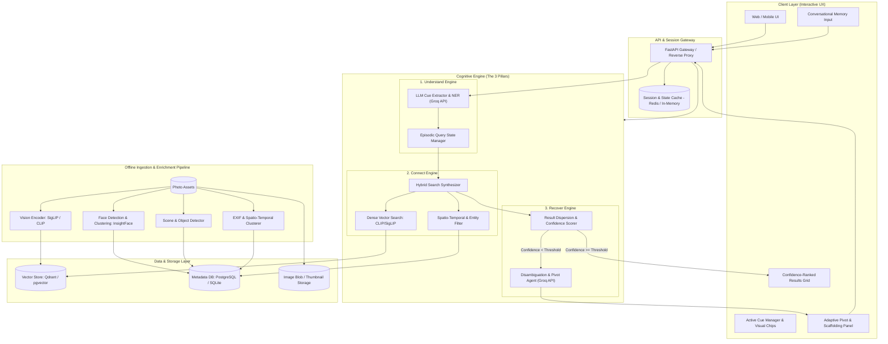
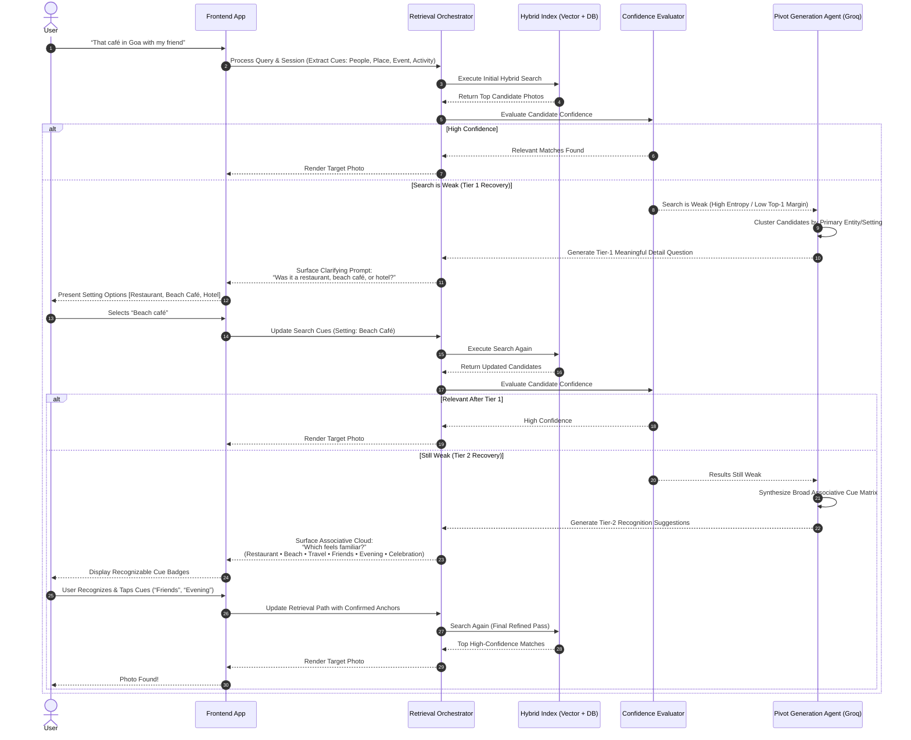

# System Architecture Specification: AI-Native Photo Retrieval MVP

## 1. Architectural Overview & Design Philosophy

The AI-Native Photo Retrieval MVP is engineered to solve the discrepancy between human episodic memory (fuzzy, relational, associative) and digital photo indexing (rigid, metadata-dependent).

### Core Architectural Principles
1. **Recognition Over Recall**: The system architecture moves the cognitive burden from the user to the engine. Instead of forcing users to refine text queries, the engine proactively synthesizes recognizable visual, social, and contextual pivots.
2. **Multi-Modal Symmetry**: Text queries, natural-language memories, image contents, and temporal/spatial metadata are mapped into a shared semantic and contextual retrieval space.
3. **Loop-Driven Cognition (Understand → Connect → Recover)**: The retrieval process is modeled as an interactive, multi-turn state machine rather than an isolated, stateless search request.
4. **Sub-Second Interactive Latency**: Prompt cue extraction, vector similarity scoring, and pivot recommendation are optimized to deliver conversational responsiveness (< 800ms total loop latency).

---

## 2. High-Level System Architecture

The following diagram illustrates the end-to-end component topology, data flows, and sub-systems.



---

## 3. Subsystem Breakdown

### 3.1 Subsystem A: Client & Interactive Scaffolding Layer
* **Conversational Memory Input**: Accepts free-form, conversational statements (*"that small café during our Goa trip with my friend"*).
* **Active Cue Manager (Tags/Chips)**: Exposes extracted entities (`Location: Goa`, `Entity: Friend`, `Atmosphere: Café`, `Event: Trip`) as interactive chips that users can tap to verify, pin, or delete.
* **Results Visualizer**: Displays candidate photos with soft confidence visualizers (grouping by likely clusters or timeline brackets).
* **Adaptive Pivot & Scaffolding Panel**: An interactive discovery area that surfaces progressive AI-suggested recovery options when search confidence is low:
  * **Tier 1 (Meaningful Detail Prompts)**: Direct clarifying questions to resolve setting/entity ambiguity (*"Was it a restaurant, beach café, or hotel?"*).
  * **Tier 2 (Associative Recognition Matrix)**: Multi-attribute cue clouds (*"Which feels familiar?"* across *Restaurant • Beach • Travel • Friends • Evening • Celebration*) and visual/face companion thumbnails.

---

### 3.2 Subsystem B: The "Understand" Engine (Cognitive Extraction via Groq API)
* **LLM Semantic Slot Extractor**: Powered by the **Groq API** (`GROQ_API_KEY`) using high-speed models such as `llama-3.3-70b-versatile` or `llama-3.1-8b-instant`. Running on Groq's custom LPU (Language Processing Unit) architecture, it achieves near-instantaneous token generation (300–500 tokens/sec) and ultra-low time-to-first-token (< 200ms).
* **Structured Output Schema**: Uses Groq's native JSON mode (`response_format={"type": "json_object"}`) or Pydantic instructor validation to reliably extract semantic facets:
  * `spatial`: General region, landmarks, indoor vs. outdoor.
  * `temporal`: Relative timeline, season, time of day, holiday context.
  * `social`: Companions, solo vs. group, family, coworkers.
  * `visual_concepts`: Colors, objects, food/drink, architectural style.
  * `affective_vibe`: Cozy, party, scenic, relaxed.
* **Query State Manager**: Maintains active retrieval session state, tracking user query history, rejected pivots, and confirmed anchors.

```
Conversational Prompt:
"I’m looking for that small café we went to during our Goa trip with my friend."
                         │
                         ▼
        [ LLM Structured Extraction Layer ]
                         │
                         ▼
{
  "spatial": { "region": "Goa", "setting": "café", "environment": "small / cozy" },
  "temporal": { "relative_concept": "trip / vacation" },
  "social": { "companion_type": "friend", "group_size": "duo/small group" },
  "visual_concepts": ["coffee", "food", "table", "indoor/outdoor café"],
  "confidence_score": 0.82
}
```

---

### 3.3 Subsystem C: The "Connect" Engine (Multi-Modal Hybrid Retrieval)
* **Dense Semantic Matching**: Encodes extracted visual concepts and full prompt context using multi-modal encoders (e.g., SigLIP or ViT-B/16 CLIP). Computes cosine similarity against image embeddings stored in the Vector DB.
* **Spatio-Temporal Event Clustering (ST-DBSCAN)**:
  * Photos are pre-grouped during ingestion into discrete "Trips / Events" using spatio-temporal clustering (DBSCAN over timestamp delta + GPS Haversine distance).
  * The query term `"Goa trip"` directly filters candidates to photo clusters located in Goa bounded within coherent time windows.
* **Social / Face Graph Filter**:
  * Cross-references the detected companion cues (`friend`) with facial clustering embeddings (InsightFace / FaceNet) to boost photos with recurring companion faces.
* **Score Fusion (Reciprocal Rank Fusion / Weighted Hybrid Scoring)**:
  $$\text{FinalScore}(P) = w_v \cdot S_{\text{vector}}(P) + w_m \cdot S_{\text{metadata}}(P) + w_s \cdot S_{\text{social}}(P) + w_t \cdot S_{\text{temporal}}(P)$$

---

### 3.4 Subsystem D: The "Recover" Engine (Progressive 2-Tier Disambiguation)
The core differentiator of this system is its progressive recovery mechanism when an initial search yields ambiguous or low-confidence results.



#### Disambiguation Strategy:
1. **Tier 1 — Meaningful Details (Setting & Category Discrimination)**:
   * When initial search dispersion is high, the engine inspects top candidate photos and extracts the primary differentiating setting or category variance.
   * Prompts Groq to formulate a concise, targeted question: *“Was it a restaurant, beach café, or hotel?”*
   * Purpose: Rapidly prune 60–80% of irrelevant candidate branches with a single tap.
2. **Tier 2 — Recognition / Suggestion (Multi-Dimensional Associative Cloud)**:
   * If results remain ambiguous or weak after Tier 1, the engine shifts cognitive modes from *structural categorization* to *experiential recognition*.
   * Groq synthesizes associative episodic anchors across orthogonal dimensions:
     * **Activity & Venue:** `Restaurant`, `Beach`, `Travel`
     * **Social Context & Atmosphere:** `Friends`, `Evening`, `Celebration`
   * Purpose: Jogs the user's autobiographical memory when they cannot recall exact metadata.
3. **Progressive Retrieval Path Updating**:
   * Each user interaction updates `retrieval_session.extracted_cues` with confirmed status and adjusts the hybrid retrieval scoring weights in real time (< 250ms).

---

## 4. Data Models & Schemas

### 4.1 Photo Item Entity (`photos`)
```json
{
  "photo_id": "uuid-v4",
  "storage_path": "photos/2023/11/IMG_4021.jpg",
  "thumbnail_path": "thumbnails/2023/11/IMG_4021_thumb.webp",
  "timestamp": "2023-11-14T11:42:10Z",
  "exif": {
    "camera_model": "iPhone 14 Pro",
    "focal_length": 24.0,
    "iso": 64
  },
  "location": {
    "latitude": 15.4989,
    "longitude": 73.8278,
    "reverse_geocoded": {
      "city": "Panaji",
      "region": "Goa",
      "country": "India",
      "neighborhood": "Fontainhas"
    }
  },
  "event_cluster_id": "event-goa-nov-2023",
  "faces": [
    { "face_id": "face_cluster_89", "bounding_box": [120, 80, 240, 210] }
  ],
  "visual_tags": ["café", "coffee cup", "wood table", "indoor", "warm lighting"],
  "embedding_vector_id": "vec-photo-4021"
}
```

### 4.2 Active Query Session & Memory Context (`retrieval_session`)
```json
{
  "session_id": "sess_89f02a",
  "raw_query": "that small café we went to during our Goa trip with my friend",
  "turn_count": 2,
  "recovery_tier": "tier_2_recognition",
  "extracted_cues": [
    { "id": "cue_1", "type": "place", "value": "Goa", "status": "confirmed" },
    { "id": "cue_2", "type": "activity", "value": "café", "status": "confirmed" },
    { "id": "cue_3", "type": "people", "value": "friend", "status": "active" },
    { "id": "cue_4", "type": "setting_detail", "value": "beach café", "status": "user_selected_tier_1" },
    { "id": "cue_5", "type": "associative_vibe", "value": "evening / celebration", "status": "user_selected_tier_2" }
  ],
  "active_filter_bounds": {
    "temporal_window": ["2023-11-10T00:00:00Z", "2023-11-18T23:59:59Z"],
    "geo_region": "Goa"
  },
  "candidate_photo_ids": ["uuid-4021", "uuid-4022", "uuid-4089"],
  "confidence_score": 0.94,
  "target_retrieved": true
}
```

### 4.3 Recovery Pivot Schemas (`pivot_prompt`)

#### Tier 1: Meaningful Details Prompt Schema
```json
{
  "prompt_id": "pvt_tier1_101",
  "tier": 1,
  "prompt_type": "meaningful_detail_question",
  "question_text": "Was it a restaurant, beach café, or hotel?",
  "options": [
    { "option_id": "opt_restaurant", "label": "Restaurant", "filter_modifier": { "venue_type": "restaurant" } },
    { "option_id": "opt_beach_cafe", "label": "Beach Café", "filter_modifier": { "venue_type": "beach_cafe" } },
    { "option_id": "opt_hotel", "label": "Hotel", "filter_modifier": { "venue_type": "hotel" } }
  ]
}
```

#### Tier 2: Associative Recognition Suggestion Schema
```json
{
  "prompt_id": "pvt_tier2_201",
  "tier": 2,
  "prompt_type": "recognition_cue_cloud",
  "question_text": "Which feels familiar?",
  "cue_groups": [
    {
      "category": "Activity & Setting",
      "cues": ["Restaurant", "Beach", "Travel"]
    },
    {
      "category": "Social & Atmosphere",
      "cues": ["Friends", "Evening", "Celebration"]
    }
  ]
}
```

### 4.4 Same-Location Related Moments Schema (`GET /api/photos/{photo_id}/related`)

To ensure that the "Other Related Moments" panel displays authentic photos from the same physical venue and trip rather than unrelated search hits, the engine implements a multi-tier fallback hierarchy:

```json
{
  "related": [
    {
      "photo_id": "photo_1021",
      "filename": "IMG_GOA_1021.jpg",
      "thumbnail_url": "/thumbnails/IMG_GOA_1021_thumb.webp?v=match_v5",
      "full_photo_url": "/photos/IMG_GOA_1021.jpg?v=match_v5",
      "neighborhood": "Boutique Resort Room",
      "city": "Calangute",
      "region": "Goa",
      "event_cluster_id": "event-goa-nov-2023",
      "scene_type": "hotel_resort",
      "caption": "Sunny morning coffee by the private veranda of our boutique resort room in Calangute."
    }
  ],
  "total": 8
}
```

#### Ranking Hierarchy:
1. **Pass 1 — Exact Venue:** `neighborhood = ? AND city = ?`
2. **Pass 2 — Same City/Town:** `city = ?` (e.g. all Calangute or Panaji photos)
3. **Pass 3 — Same Event & Scene Type:** `event_cluster_id = ? AND scene_type = ?` (e.g. resort stay during Goa trip)
4. **Pass 4 — Same Event Cluster:** `event_cluster_id = ?` (overall trip photos)
5. **Pass 5 — Same Region & Scene:** `region = ? AND scene_type = ?`
6. **Pass 6 — Same Region Fallback:** `region = ?`

#### Interactive Hero Card Swapping:
When a user clicks any thumbnail in "Other Related Moments", the client executes an instant two-way swap:
* The clicked photo becomes the active **Hero Photo Card** (`#strong-results-layout`), updating the image, location tag, and date.
* The previous hero photo immediately transitions into the related moments thumbnail grid.

---

## 5. Technology Stack & Implementation Choices

| Architectural Tier | Selected Technology | Technical Rationale |
| :--- | :--- | :--- |
| **Frontend Framework** | **React / Next.js / TypeScript** + Vanilla CSS Design Tokens | Interactive state-driven UI, rapid rendering of dynamic chips, instant visual updates for pivot transitions. |
| **API Backend** | **FastAPI (Python 3.11+)** | High performance async I/O, seamless integration with Python AI/ML ecosystem, native Pydantic schema validation. |
| **Multi-Modal Vision Encoder** | **Google SigLIP (ViT-B-16 / SO400M) or OpenCLIP** | Superior zero-shot text-to-image semantic alignment and compact 512-768 dimensional embeddings. |
| **Cognitive LLM Orchestrator** | **Groq API (`llama-3.3-70b-versatile` / `llama-3.1-8b-instant`)** | Industry-leading LPU inference speed (300–500 tokens/s, < 200ms TTFT), native structured JSON schema mode, cost-effective high-throughput reasoning over ambiguous episodic memories. |
| **Vector Store** | **Qdrant** or **pgvector (PostgreSQL 16)** | Real-time HNSW index with payload filtering (filtering by GPS, date ranges, and face cluster IDs alongside vector distance). |
| **Face & Clustering Libs** | **InsightFace + Scikit-Learn (DBSCAN)** | Highly accurate lightweight face embedding extraction and spatial-temporal photo grouping. |
| **Session Cache** | **Redis (or in-process LRU cache for MVP)** | Ephemeral session state tracking for active memory cue pivots across conversational turns. |

---

## 6. Non-Functional Requirements & System Guarantees

### 6.1 Performance Budgets
* **End-to-End Query Latency**: $\le 600\text{ ms}$ for initial search response (accelerated by Groq's sub-200ms TTFT).
* **Pivot Resolution Latency**: $\le 250\text{ ms}$ upon user selecting a suggested cue chip.
* **Thumbnail Delivery**: $\le 100\text{ ms}$ using modern WebP formats and edge caching.

### 6.2 Privacy & Security Safeguards
* **Local / Tenant Isolation**: Personal photo libraries are isolated per user namespace; embeddings are indexed in tenant-isolated collections.
* **EXIF Redaction**: Sensitive GPS coordinates are sanitized on client responses and served only at aggregate/neighborhood level unless explicitly permitted.
* **API Key Security**: The Groq API key (`GROQ_API_KEY`) is kept strictly server-side in backend environment configurations.
* **On-Device Extensibility**: The architectural design decouples the vision encoder, allowing future migration to on-device WebGPU / CoreML pipelines.

### 6.3 Graceful Degradation
* If the Groq API encounters network timeouts or rate limits, the system triggers exponential backoff or automatically falls back to regex-based heuristics and direct CLIP text-image vector scoring.
* If GPS data is absent from photos, the engine elevates visual-concept and face-clustering weights automatically.

---

## 7. MVP Verification & Measurement Harness

To validate the success criteria outlined in the Problem Statement, the architecture embeds a telemetry interceptor:

1. **Retrieval Success Logger**: Tracks whether a user clicks "That's the photo!" or downloads/views a photo in full resolution.
2. **Pivot Affinity Tracker**: Measures user interaction with suggested recovery cues:
   $$\text{Pivot Acceptance Rate} = \frac{\text{Accepted Pivot Cues}}{\text{Total Suggested Pivot Cues}}$$
3. **Search Effort Tracker**: Records `duration_ms`, `total_user_keystrokes`, and `total_pivot_clicks` per successful retrieval session.
