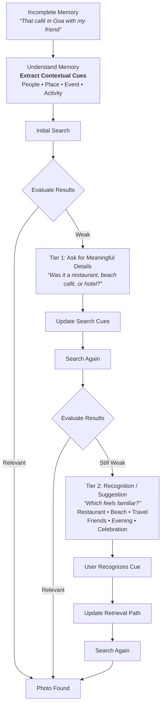

# Project Context & Problem Statement

## 1. Executive Summary

Modern photo libraries contain thousands of unorganized images spanning years of personal history. While modern photo management applications offer basic semantic search (e.g., searching for "dog" or "beach"), they rely heavily on users formulating exact keywords or recalling specific metadata (dates, locations, album names).

In reality, human episodic memory is associative, fuzzy, and contextual. Users frequently recall a specific photo through emotional or relational fragments (e.g., *"that small café during our trip with my friend"*), but cannot recall the structural metadata required by standard search engines. When initial semantic or keyword queries return poor results, users face cognitive friction: they do not know what clue to search next, enter repetitive guess-and-check cycles, and ultimately abandon the search.

This project aims to build an **AI-native photo retrieval experience** that bridges the gap between **human episodic memory** and **digital image retrieval** through active cue extraction, multi-turn reasoning, and intelligent recovery pathways.

---

## 2. Core Problem Statement

> **How might we help users recover a remembered-but-poorly-described photo by turning incomplete memories into actionable retrieval cues and guiding them to a new retrieval path when the initial search fails?**

### The Core Tension: Recall vs. Recognition
* **Recall (Hard):** Demanding the user remember exact dates, specific café names, or exact locations.
* **Recognition (Easy):** Presenting the user with associative cues, visual anchors, or chronological milestones that trigger memory when seen.

Traditional photo search systems force **recall**. This project re-engineers retrieval around **recognition**.

---

## 3. Core User Scenario & Memory Anatomy

### User Query Example
> *"I'm looking for that small café we went to during our Goa trip with my friend."*

### Episodic Memory Breakdown

| Memory Dimension | User Can Remember (Episodic Fragments) | User Cannot Recall (Indexed Metadata) |
| :--- | :--- | :--- |
| **Entities & People** | Traveled with a specific friend | Friend's tagged face ID / contact name in metadata |
| **Location & Setting** | A "small café", general region ("Goa") | Exact street address, GPS coordinates, café name |
| **Temporal Context** | A past trip, rough season/vibe | Exact date, month, or year |
| **Visual / Environmental** | Cozy indoor/outdoor café setting | Album names, camera tags, EXIF details |

---

## 4. MVP Goal & The Retrieval Experience Loop

The objective of the MVP is to replace static one-shot query boxes with an adaptive, guided retrieval cycle that actively assists the user when confidence is low.

### The Guided Retrieval Flow



---

## 5. Core AI Intelligence Pillars

The MVP demonstrates three fundamental AI capabilities:

```
┌────────────────────────────────────────────────────────────────────────┐
│                        AI Intelligence Pillars                         │
├───────────────────┬──────────────────────┬─────────────────────────────┤
│   1. UNDERSTAND   │      2. CONNECT      │          3. RECOVER         │
│  Extract Cues     │   Multi-Modal Paths  │ 2-Tier Progressive Recovery │
├───────────────────┼──────────────────────┼─────────────────────────────┤
│ Parse ambiguous,  │ Map extracted cues   │ Tier 1: Ask meaningful      │
│ emotional natural │ to visual embeddings,│ details to narrow setting.  │
│ language into     │ temporal clusters,   │ Tier 2: Surface associative │
│ structured memory │ geolocation bounds,  │ recognition anchors if      │
│ anchors.          │ and co-occurrences.  │ search is still weak.       │
└───────────────────┴──────────────────────┴─────────────────────────────┘
```

### 1. Understand (Cognitive Extraction via Groq API)
* Powered by the **Groq API** (`GROQ_API_KEY`) using high-speed open models (e.g., Llama 3.3 70B / Llama 3.1 8B) running on Groq LPUs to achieve ultra-fast, sub-second extraction.
* Transforms unstructured conversational inputs into structured semantic anchors:
  * **People & Social Context:** e.g., `friend`, companion cluster, duo.
  * **Place & Spatial Bounds:** e.g., `Goa`, coastal, café vs. restaurant.
  * **Event & Temporal Window:** e.g., vacation trip, milestone, holiday.
  * **Activity & Visual Concepts:** e.g., eating/drinking, coffee cup, scenic seating.

### 2. Connect (Contextual & Multi-Modal Linking)
* Cross-references extracted cues with photo collection signals (image embeddings, scene classifiers, timestamps, spatial clusters).
* Establishes candidate retrieval paths (e.g., cluster of photos taken in Goa featuring two people with café/food visual features).

### 3. Recover (Progressive 2-Tier Disambiguation via Groq API)
When search confidence is low or dispersion is high, the system executes a progressive two-stage recovery ladder:
* **Tier 1 — Ask for Meaningful Details (Setting & Category Discrimination):**
  * Evaluates candidate cluster variance and poses a targeted clarifying question:
  * *“Was it a restaurant, beach café, or hotel?”*
  * Updates active search cues and re-executes search.
* **Tier 2 — Recognition / Suggestion (Associative Cue Matrix):**
  * If results remain weak after Tier 1, the system falls back to associative memory anchors, asking:
  * *“Which feels familiar?”*
  * Surfaces a recognizable cue cloud across orthogonal dimensions:
    * **Activity/Setting:** `Restaurant`, `Beach`, `Travel`
    * **Social/Atmosphere:** `Friends`, `Evening`, `Celebration`
  * User taps any recognized cue $\rightarrow$ updates retrieval path $\rightarrow$ final search surfaces the target photo.

---

## 6. Guiding Product Principle

> **"Don't make users remember more. Help them discover what they already partially remember."**

* **Avoid dead ends:** Never show an empty state that simply says *"No results found. Try another search."*
* **Provide scaffolding:** Offer interactive pivot chips, visual breadcrumbs, and clarifying options.
* **Low cognitive burden:** Interaction should feel like talking with a friend who was there and is helping jog your memory.

---

## 7. MVP Scope & Functional Capabilities

1. **Conversational Query Interface**: Accepts natural language input reflecting vague or partial memories.
2. **Cue Extraction & Visual Representation (Groq API)**: Parses natural language into memory dimensions via Groq LPU inference and displays extracted cues as interactive chips.
3. **Multi-Modal Retrieval Engine**: Searches a sample photo dataset utilizing visual semantics, metadata, and cluster relationships.
4. **Confidence Evaluator**: Assesses relevance and spread of search results to determine whether recovery mode is required.
5. **Recovery & Cue Recommendation Engine (Groq API)**: Synthesizes contextually relevant multiple-choice prompts, visual anchor options, and disambiguation questions using Groq when results are weak.
6. **Iterative Refinement**: Dynamically updates the retrieval filter based on user recognition feedback.

---

## 8. MVP Success Criteria & Evaluation Metrics

| Metric | Target / Definition |
| :--- | :--- |
| **Retrieval Success Rate** | % of search sessions where the user successfully identifies the target photo. |
| **Time to Retrieve (TTR)** | Average duration (in seconds/minutes) from initial prompt to target photo selection. |
| **Search Query Attempts** | Reduction in manual re-typing attempts compared to standard keyword search. |
| **Recovery / Pivot Interaction Rate** | Frequency and success of user interactions with suggested recovery cues. |
| **Cue Recognition Rate** | % of AI-suggested cues that the user recognizes and validates as relevant. |
| **User-Reported Effort (Cognitive Load)** | Qualitative score (e.g., Single Ease Question / NASA-TLX subset) measuring ease of retrieval. |
